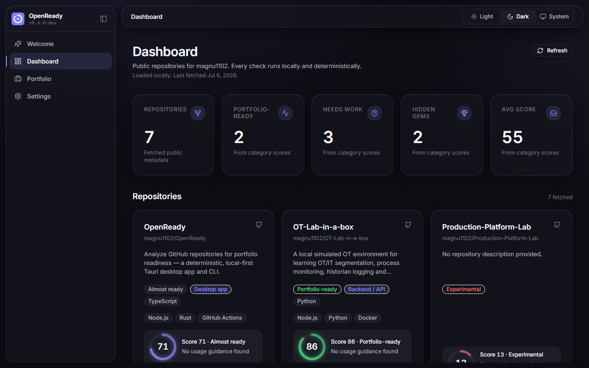
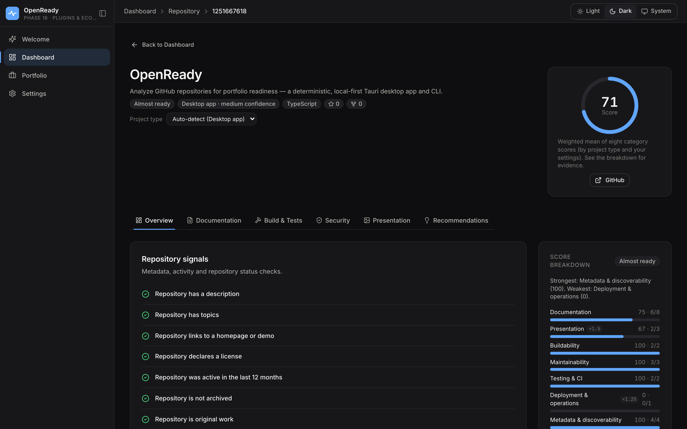
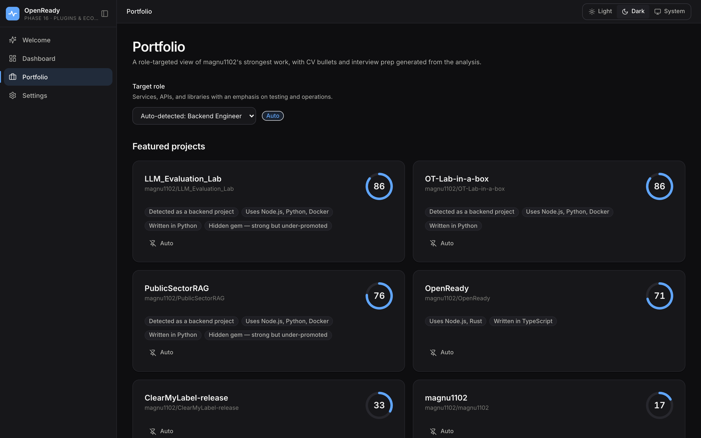
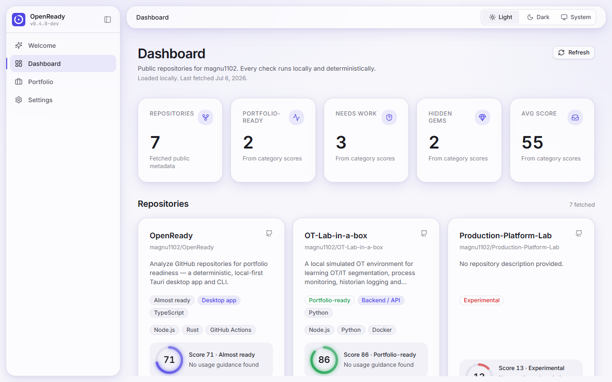
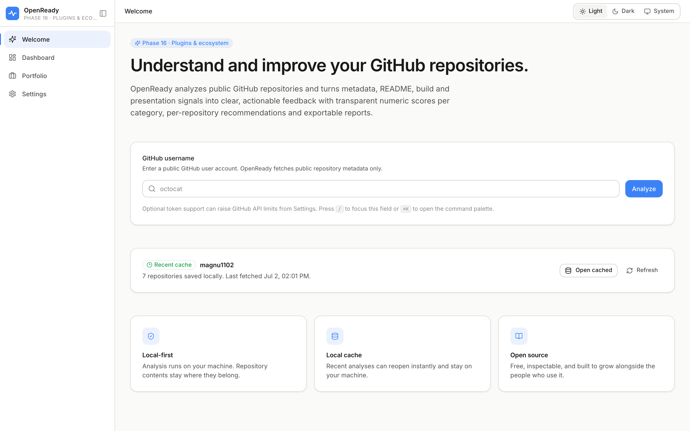

<div align="center">

<picture>
  <source media="(prefers-color-scheme: dark)" srcset="public/brand/openready-wordmark-dark.svg">
  
</picture>

**Know which repositories are ready to show.**

[](https://github.com/magnu1102/OpenReady/releases/latest)
[](LICENSE)
[](https://github.com/magnu1102/OpenReady/actions/workflows/lint-and-test.yml)

</div>

OpenReady is an open-source desktop app that analyzes public GitHub repositories and turns documentation, licensing, CI, build and presentation signals into transparent scores and prioritized next steps. Enter a username; get a clear answer to one question: _which of these projects are ready to show someone, and what should each one fix first?_

Every check is deterministic and runs on your machine. No account, no cloud, no AI required — an opt-in AI assist exists, but the core never depends on it.

> **Status:** v0.5.0 — Phase 20, distribution hardening, complete: the CLI installs from npm, Rust checks run in CI on three OSes, the auto-updater is wired (gated until releases are signed), and a Playwright smoke guards the analyze flow. Next up: Phase 21, product trust and polish. See the [roadmap](docs/roadmap.md).

## Screenshots



|                                          Repository detail                                           |                                     Portfolio mode                                     |
| :--------------------------------------------------------------------------------------------------: | :------------------------------------------------------------------------------------: |
|  |  |

|                           Light theme                            |                                 Welcome screen                                 |
| :--------------------------------------------------------------: | :----------------------------------------------------------------------------: |
|  |  |

## Features

- **Deterministic scoring** — eight weighted categories per repository, every score backed by a visible list of passed and failed checks. Same repository, same result.
- **Project-aware expectations** — a CLI is judged like a CLI, a library like a library. Classification is automatic, with manual overrides.
- **Prioritized recommendations** — ranked by score impact, so the first item on the list is always the highest-leverage fix.
- **Hidden-gem detection** — strong repositories with weak discoverability get flagged instead of buried.
- **Portfolio mode** — role-targeted featured projects with CV bullets and interview talking points, exportable as Markdown.
- **Comparison** — up to three repositories side by side, per-category.
- **Exports** — Markdown reports, `openready.export.v1` JSON, and homepage project cards, saved only where you choose.
- **CI gating** — the same analyzer as a CLI and a composite GitHub Action (`--fail-under`, `--require-check`, score badges).
- **Extensible** — custom check packs and shareable team profiles with versioned JSON Schemas.

## Tech stack

OpenReady is built as a local-first desktop product with a shared analyzer that
also runs from the command line and GitHub Actions.

| Area             | Technologies                                                                |
| ---------------- | --------------------------------------------------------------------------- |
| Desktop shell    | Tauri 2, Rust, WebView2 on Windows                                          |
| Frontend         | React 19, TypeScript, Vite                                                  |
| UI and styling   | Tailwind CSS, Radix primitives, lucide-react, Aurora design tokens          |
| State and motion | Zustand, Framer Motion                                                      |
| Analyzer         | Framework-free TypeScript modules under `src/modules/`                      |
| CLI              | Node.js 20+, esbuild-bundled ESM                                            |
| Testing          | Vitest, Testing Library, Playwright                                         |
| CI and releases  | GitHub Actions, composite GitHub Action, `tauri-apps/tauri-action`, npm CLI |

## Quickstart

### Prerequisites

- [Node.js](https://nodejs.org/) 20+
- [pnpm](https://pnpm.io/) 10+
- [Rust](https://rustup.rs/) (stable toolchain, MSVC on Windows)
- WebView2 (ships with Windows 11)

### Run the desktop app

```bash
pnpm install
pnpm tauri dev
```

### Run only the frontend (faster iteration)

```bash
pnpm dev
```

This opens OpenReady in your browser without compiling the Rust shell.

## Usage

### First analysis

1. Enter a public GitHub username on the Welcome screen.
2. OpenReady fetches public repository metadata — optionally with a locally stored token for higher rate limits.
3. The Dashboard shows health labels, scores and the key missing signal per repository.
4. Open a repository for score breakdowns, detected stack, per-category checks and prioritized recommendations.
5. Export the analysis as Markdown, JSON or homepage cards; recent analyses reopen instantly from the local cache.

Tokens live in the operating system credential store, never in browser storage. Export files are written only to locations picked through the save dialog.

### Run the CLI

The CLI runs the same deterministic analyzer outside the desktop shell — for scripts, CI, or a quick terminal check.

```bash
# From npm (Node 20+)
npm install -g openready
openready analyze octocat

# Or one-off
npx openready analyze octocat --format json --out octocat.json
```

From a source checkout:

```bash
# Dev runs via tsx
pnpm cli -- analyze octocat --limit 5 --no-readme --no-tree

# Build a self-contained ESM bundle
pnpm build:cli
node dist-cli/openready.mjs analyze octocat --format json --out octocat.json
```

Common flags:

| Flag                             | Purpose                                    |
| -------------------------------- | ------------------------------------------ |
| `--format table\|json\|markdown` | Output format (default `table`)            |
| `--limit <n>`                    | Max repositories analysed (default 30)     |
| `--repo <name>`                  | Focus a single repository                  |
| `--out <path>`                   | Write output to a file instead of stdout   |
| `--token <value>`                | GitHub PAT for higher rate limits          |
| `--no-readme` / `--no-tree`      | Skip README or file-tree fetches for speed |

Token resolution order: `--token`, then `OPENREADY_GITHUB_TOKEN`, then `GITHUB_TOKEN`. Without a token GitHub limits unauthenticated requests to ~60/hour. Output respects [`NO_COLOR`](https://no-color.org/) and falls back to plain text when stdout isn't a TTY.

### Environment variables

OpenReady does not require environment variables for normal desktop use. The
optional variables below are for CLI runs, CI, or development convenience. Copy
`.env.example` to `.env` only for local experiments; never commit real tokens.

| Variable                 | Used by       | Purpose                                                          |
| ------------------------ | ------------- | ---------------------------------------------------------------- |
| `OPENREADY_GITHUB_TOKEN` | CLI           | Preferred GitHub token for higher API rate limits.               |
| `GITHUB_TOKEN`           | CLI / Actions | Fallback token; GitHub Actions provides this automatically.      |
| `NO_COLOR`               | CLI           | Disables ANSI color output when set to any value.                |
| `TAURI_DEV_HOST`         | Dev server    | Exposes Vite/Tauri dev server to another host during local work. |

### Use in CI

The repo doubles as a composite GitHub Action: gate pull requests on your OpenReady score and publish a score badge, with zero install.

```yaml
- uses: magnu1102/OpenReady@v0.3.0
  with:
    username: OWNER
    repo: REPO
    fail-under: 70
```

See [docs/github-action.md](docs/github-action.md) for the inputs/outputs reference, badge setup, and copy-pasteable example workflows.

### Useful scripts

```bash
pnpm lint        # ESLint
pnpm typecheck   # TypeScript --noEmit
pnpm test        # Vitest
pnpm format      # Prettier write
```

## What OpenReady does not do

- Send repository contents to any third party
- Require a GitHub account or login
- Require AI keys for core functionality
- Persist anything to a remote database
- Store GitHub tokens in browser local storage

## Documentation

- [Product principles](docs/product-principles.md)
- [Design system (Aurora)](docs/design-system.md)
- [Voice and tone](docs/voice-and-tone.md)
- [Architecture](docs/architecture.md)
- [Scoring model](docs/scoring-model.md)
- [Project classification](docs/classification.md)
- [Tech-stack detection](docs/tech-stack-detection.md)
- [CLI](docs/cli.md)
- [GitHub Action](docs/github-action.md)
- [JSON schemas](docs/json-schema.md)
- [Custom checks and profiles](docs/plugins.md)
- [Portfolio mode](docs/portfolio.md)
- [Onboarding and keyboard](docs/onboarding-and-keyboard.md)
- [Releasing](docs/releasing.md)
- [Signing notes](docs/signing.md)
- [Privacy model](docs/privacy.md)
- [AI expansion](docs/ai-expansion.md)
- [Roadmap](docs/roadmap.md)
- [Changelog](CHANGELOG.md)

## Roadmap

See [docs/roadmap.md](docs/roadmap.md) for the phase outline and [`openready_master_plan.md`](openready_master_plan.md) for the full long-form plan.

## Contributing

Contributions are welcome. Read [CONTRIBUTING.md](CONTRIBUTING.md) for setup, the quality gates, and the pull-request flow — UI copy follows the [voice and tone guide](docs/voice-and-tone.md) — plus our [Code of Conduct](CODE_OF_CONDUCT.md). To report a vulnerability, see [SECURITY.md](SECURITY.md); please don't open a public issue for security problems.

## License

OpenReady is open source under the [MIT License](LICENSE).
